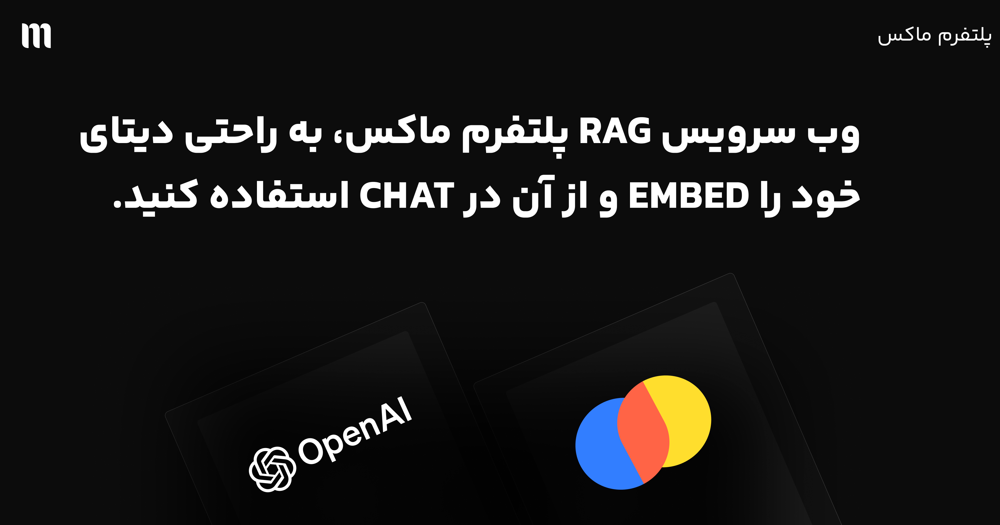

# 
# 🚀 MAUX INC RAG API

Welcome to the MAUX INC RAG API! This powerful API enables you to create a Retrieval-Augmented Generation (RAG) system using OpenAI's chat completions and embeddings, along with ChromaDB for efficient document storage and retrieval.

## 🌟 Features

- 📚 Document embedding and storage
- 🔍 Semantic search for relevant documents
- 🤖 AI-powered question answering
- 🔗 Easy integration with OpenAI and ChromaDB

## 🛠️ Installation

1. Clone the repository
2. Install dependencies:
```bash
pip install -r requirements.txt 
```

3. Set up your environment variables in a .env file
```bash
OPENAI_API_KEY=your_openai_api_key
CHROMA_PERSIST_DIRECTORY=./chroma_db
OPENAI_EMBEDDING_MODEL=text-embedding-3-small
CHAT_MODEL=gpt-4o-mini
RAG_SEARCH_LIMIT=3
SYSTEM_PROMPT="You are a helpful assistant. Use the provided context to answer the user's question. If the context is not relevant, just say 'I don't know'"
```

## 🚀 Usage

start the api with the following command:
```bash
uvicorn app.main:app --host 0.0.0.0 --port 8000
```

## 🛣️ Routes

1. initialize the collection in the vector database
Before using the API, you need to initialize the collection:

```python 
import requests

BASE_URL = "http://localhost:8000/v1"

response = requests.post(f"{BASE_URL}/vector_db/initialize_collection")
print(response.json())
```
2. Add Documents to the collection

```python 
import requests

BASE_URL = "http://localhost:8000/v1"

response = requests.post(f"{BASE_URL}/vector_db/add_document", json={
    "text": "MAUX INC is a leading AI platform for innovative solutions.",
    "metadata": {"source": "company_info"}
})
print(response.json())
```

3. Search Documents
Search for similar documents:
```python 
import requests

BASE_URL = "http://localhost:8000/v1"

response = requests.post(f"{BASE_URL}/vector_db/search_documents", json={
    "text": "ماکس چیه؟"
})
print(response.json())
```

4. Chat Completions

```python 
import requests

BASE_URL = "http://localhost:8000/v1"

response = requests.post(f"{BASE_URL}/chat/completions", json={"prompt": "ماکس چیه؟"})
response_data = response.json()
    
# Extract and print only the content
content = response_data['choices'][0]['message']['content']
print(content)
```

## 📚 Examples

examples/chat.py is a simple example of how to use the chat completions route.


## 📚 License

This project is licensed under the MIT License

## 📚 Contributing

Contributions are welcome! Please feel free to submit a PR.